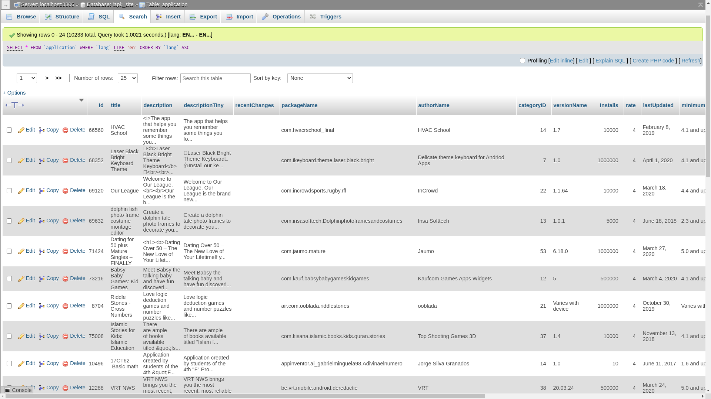

# Google Play Database Mirror

Repository of designing a crawler script to update a mirror database from Google Play.

### Crontab

Run daily:

```
$ php updater.php
```

About one hundred thousand applications extracted from this script:



### Related Repositories

- https://github.com/BaseMax/GooglePlayWebServiceAPI

---------

# Max Base

My nickname is Max, Programming language developer, Full-stack programmer. I love computer scientists, researchers, and compilers. ([Max Base](https://maxbase.org/))

## Asrez Team

A team includes some programmer, developer, designer, researcher(s) especially Max Base.

[Asrez Team](https://www.asrez.com/)
